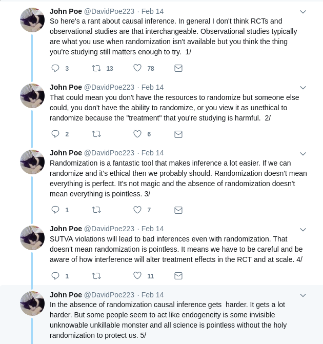
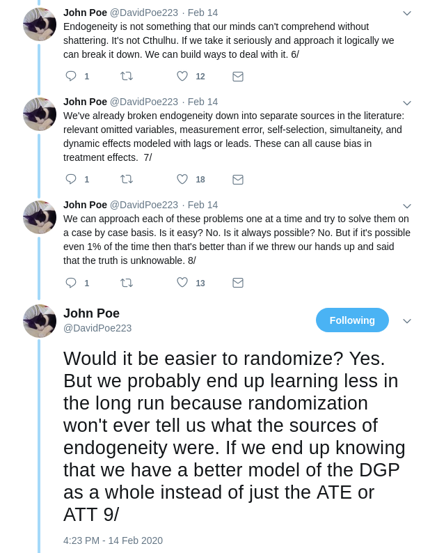
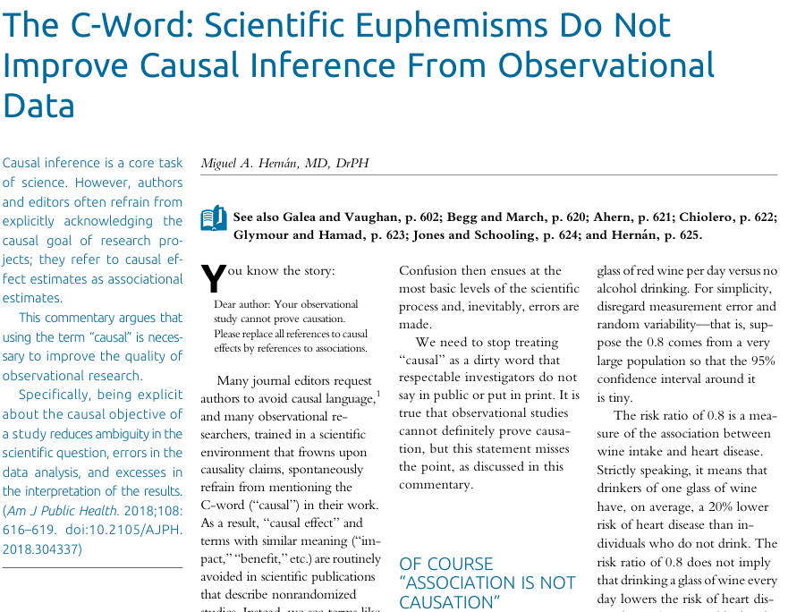
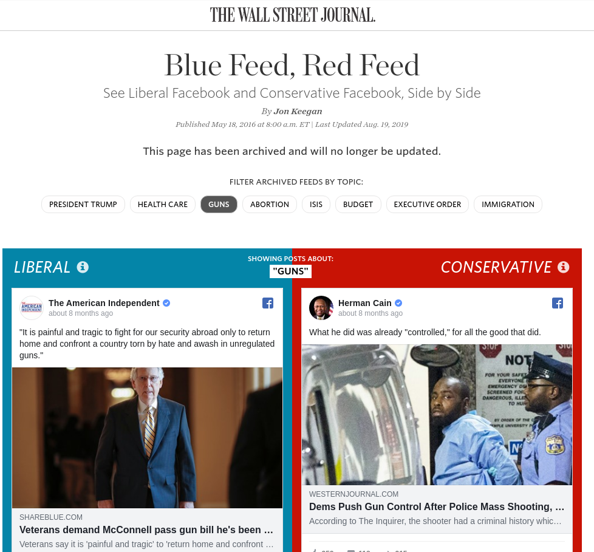
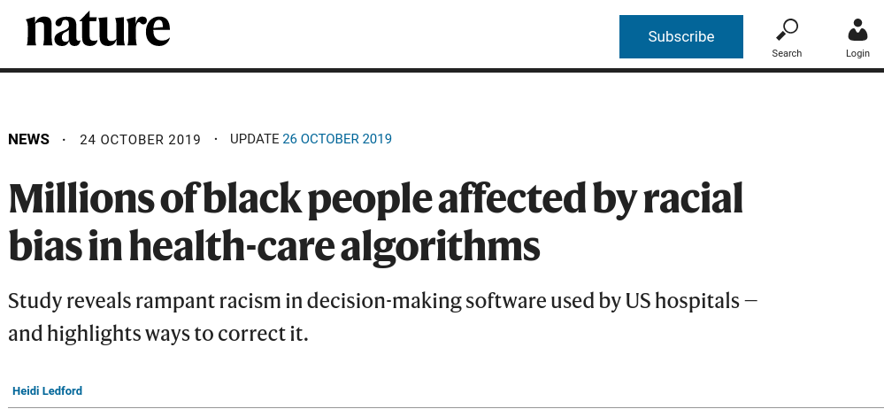
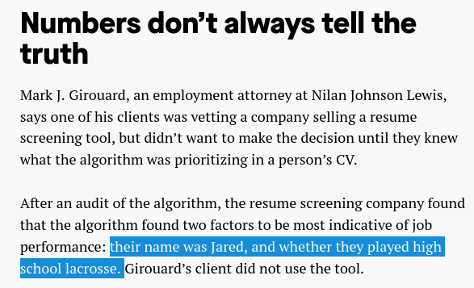
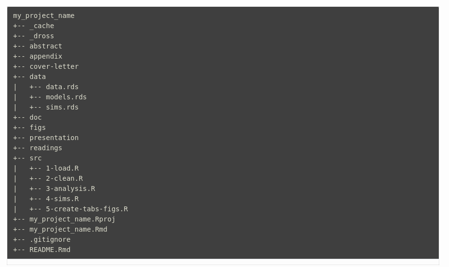
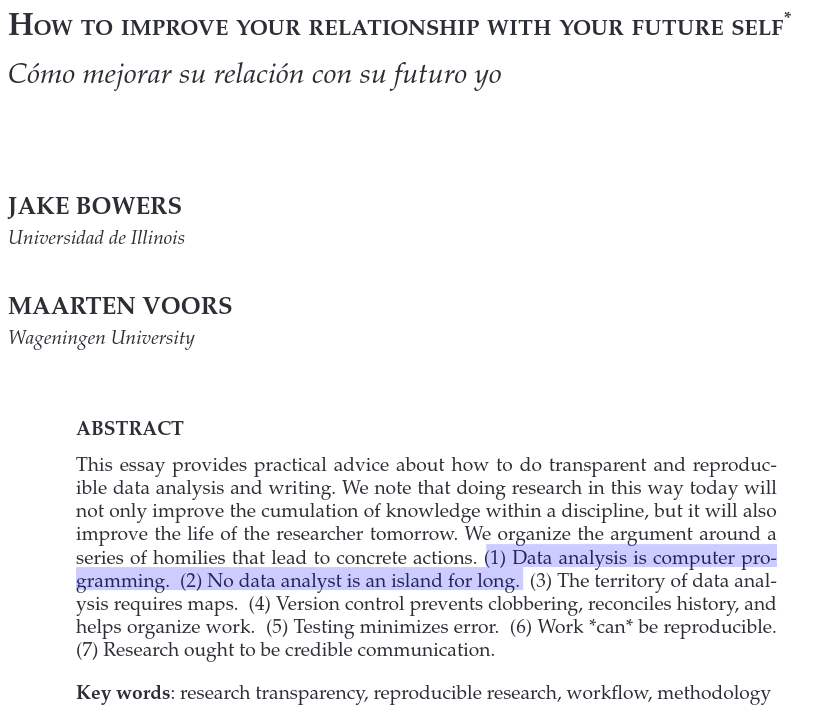

```{r setup, include=FALSE, cache=F, message=F, warning=F, results="hide"}
knitr::opts_chunk$set(cache=TRUE, warning=F)
knitr::opts_chunk$set(fig.path='figs/')
knitr::opts_chunk$set(cache.path='cache/')

knitr::opts_chunk$set(
                  fig.process = function(x) {
                      x2 = sub('-\\d+([.][a-z]+)$', '\\1', x)
                      if (file.rename(x, x2)) x2 else x
                      }
                  )
```

```{r loadstuff, include=FALSE}
knitr::opts_chunk$set(cache=FALSE)


```

# Ethics and Replication
## Introduction
### Goal for Today

*Discuss some issues of ethics and replication in social science research.*

### Going Forward

This semester you learned:

- Random assignment/experimental design
- OLS regression
- Tricks toward causal inference in regression (IVs, RDD)
- What to do when your DV isn't continuous/interval
- Some advanced topics on top of that (e.g. simulation, Bayes)

### Ethics and Replication

*I can't make you do these things in good faith...*

- Social science is rife with cases of academic misconduct.
- Publication incentives breed dishonesty; you are compelled to rise above it.

*...but I can teach you some tools to help you be honest.*

- i.e. this is academic workflow and replication.

## Issues of Ethics
### Some Ethical Takeaways

Your theoretical model is causal. Your empirical model may not be.

- Remember: everything is a "model."

*But don't shirk from using causal language!*

- Absent a causal drive, the aim of the research is directionless/vague.

There's an unnecessary tension between the RCT people and those doing observational analyses.

- Be forthright, but stand your ground.
- Again: your theoretical model is causal. Your empirical model may not be.


###



###



###




### Some Ethical Takeaways

The proliferation of machine learning/AI/"algorithms" creates more ethical issues.

1. "Treat", don't manipulate.
2. There's no bias-free model; *you are the bias.*
3. Evil is evil, whether intentional or unintentional.

Andrew Heiss (Georgia State), re: third point: "don't let stupidity transform into evil."

- Good academic workflow can help.


###



###



###



###


## Replication
### Academic Workflow and Replication

Replication crises/academic misconduct are proliferating in social science. Examples:

- Economics: Reinhart and Rogoff's (2010) Excel error
- Psychology: too many to list
    - Recurring themes: small-*n*, *p*-hacked experiments, or even fabricated data
- Sociology/criminology: Stewart retractions
- Political science: Lacour and Green (2014) scandal

I'm not going to assign motives (naiveté or something worse) to these scandals and those involved.

- But, assuming honesty, you can avoid a similar pitfall with good workflow.

### Some Tips on Good Workflow/Replication

"Kondo" your projects into sub-directories.

- Keep things tidy/de-cluttered in your project.
- I have my recommendations, but tweak for what works for you.

"Launder" your data; never overwrite them.

- Never overwrite original columns. Recode into new columns/objects.
- *Definitely* never overwrite raw data. 

Related: invest in cloud storage (e.g. Box, Dropbox).

- Create separate folders for raw data (`data`) and your individual projects (`projects`).
- Tongue in cheek: think of "my laptop broke/fried/got stolen" as the 21st century equivalent of "the dog ate my homework."

### An Example of Sub-Directories


    
### Some Tips on Good Workflow/Replication   

- Surprise! You're a computer programmer now. Embrace it.
    - Make comments to yourself in code.
    - Make your steps apparent, something you can't do in Excel.
- Make your document "dynamic."
    - Learn R Markdown. You'll thank me later.
    - This will be the lab on Thursday.
- REQUIRED: Share your work.
    - I recommend Github. Will also help with version control.
    - Don't be surprised when you get asked to upload what you did to Dataverse.
    
### 


    
## Conclusion
### Conclusion

I hope you learned a fair bit semester.

- Everything from concepts of causality to causal inference and beyond.

You must act in good faith, no matter perverse incentives.

- Be mindful of emerging ethical issues (esp. in machine learning context).
- Be prepared to 100% show the world how you did what you did.

*Don't make future you begrudge past you's incompetence or dishonesty.*