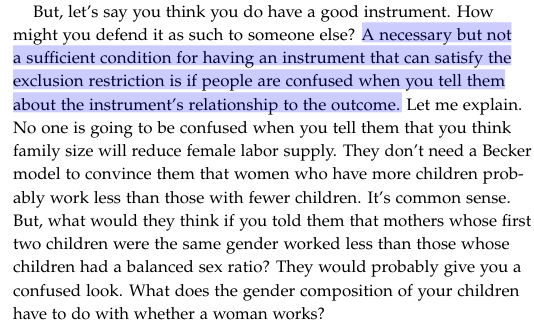
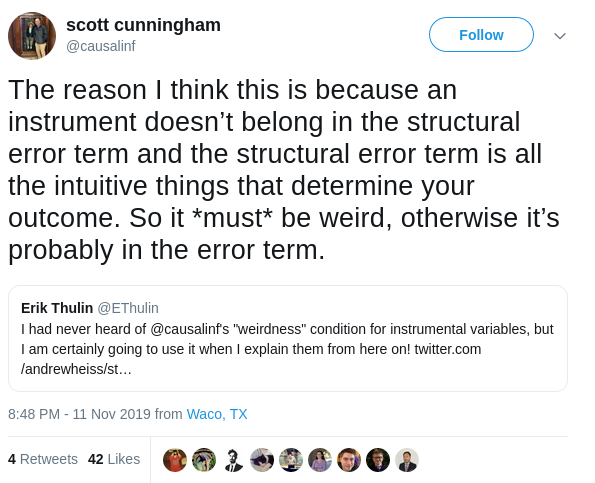
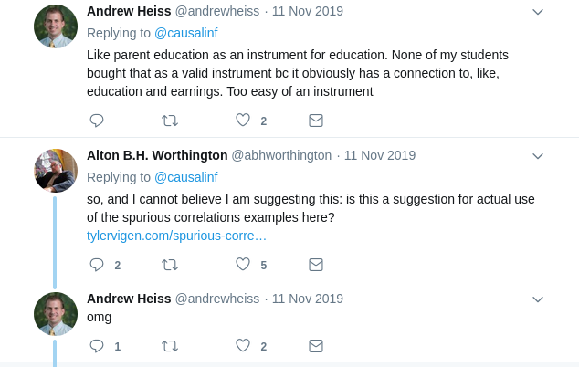
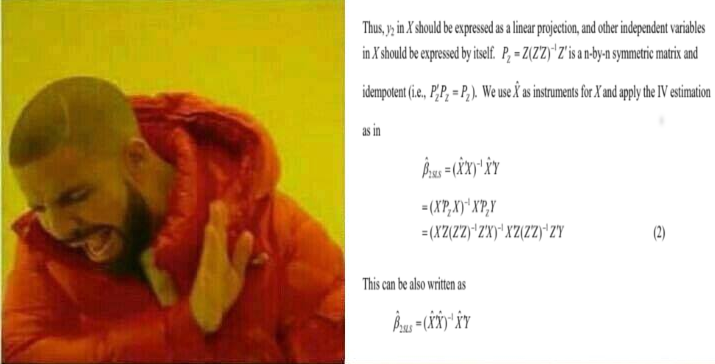

```{r setup, include=FALSE, cache=F, message=F, warning=F, results="hide"}
knitr::opts_chunk$set(cache=TRUE, warning=F)
knitr::opts_chunk$set(fig.path='figs/')
knitr::opts_chunk$set(cache.path='cache/')

knitr::opts_chunk$set(
                  fig.process = function(x) {
                      x2 = sub('-\\d+([.][a-z]+)$', '\\1', x)
                      if (file.rename(x, x2)) x2 else x
                      }
                  )
```

```{r loadstuff, include=FALSE}
knitr::opts_chunk$set(cache=FALSE)
library(tidyverse)
library(stevemisc)
library(post8000r)

```

# Instrumental Variables
## Introduction
### Goal for Today

*Introduce students to instrumental variable analysis.*

### The Problem, in a Simple Question

Does more education cause higher earnings?

- Of interest to policymakers who (well, should) incentivize more access to better education.

Simply, the intuition:

$$
\textrm{Earnings}_i = \alpha + \beta_1*\textrm{Education}_i + \epsilon_i
$$
What could be the problem here?

### The Problem

- Omitted variable bias
- Selection bias

We contend education is exogenous to earnings, but it's endogenous to a variety of factors.

### What is Endeogeneity?

Endogeneity is when a covariate in the regression is correlated with the error term ($\epsilon$). Causes:

- Omitted variable (easy fix, if you have it)
- Measurement error (a "use your head" problem)
- Simultaneity (a bit trickier, but there are solutions)

The consequence of endogeneity is bias, either:

- Rejecting a (null) hypothesis that in fact is true (Type 1)
- Failing to reject a (null) hypothesis that you in fact could (Type 2)

### On Education and Earnings

There's surely some exogenous part of education on earnings, but:

- Both education and earnings are a function of "instrinsic ability."
- "Intrinsic ability" determines motivation to pursue more education.
- "Intrinsic ability" influences the wages you obtain.

### What Can You Do About Endogeneity?

- Nothing? (Don't...)
- Panel data? (If it's obtainable/feasible/appropriate?)
- Make the unobserved observable? (but what if that's not the problem?)
- Apply instrumental variable (IV) regression? (why not?)

## Instrumental Variable (IV) Regression
### Assumptions

IV regression is ideal for a particular kind of endogeneity. Assumptions:

1. Relevance
2. Exclusion
3. Exogeneity

### Relevance

In a simple $x$ (predictor), $y$ (outcome), and $z$ (instrument) setup, $z$ must be correlated $x$.

- If it didn't, nothing would be gained from considering it in this setup.
- If it were uncorrelated with $x$, but correlated with $y$, we have something closer to the ideal setup.

### Exclusion

$z$ cannot be correlated with $y$.

- This is the "only through" language.
- $z$ affects $y$ "only through" its correlation with $x$.

Absent this exclusion restriction, the $x$, $y$, and $z$ setup reduces to an omitted variable problem.

### Exogeneity

$z$ is independent of all other factors and is randomly assigned.

## The "Huh?" Factor
### The "Huh?" Factor

IVs in the social sciences range from the intuitive to the weird:

- Card (1990): the draft ($z$) fixes the relationship between military service ($x$) and earnings ($y$).
- Levitt (1985): election cycles ($z$) fix relationship between police patrol hours ($x$) and the crime rate ($y$).
- Various: cigarette taxes ($z$) fix relationship betwen smoking ($x$) and various health outcomes ($y$).
- Miguel et al. (2004): rainfall ($z$) fixes relationship between economic shocks ($x$) and civil conflict ($y$).


### The "Huh?" Factor

If it's obvious that it should matter... 

- isn't it already in the model?
- isn't it also correlated with $y$ (violation of exclusion restriction)?

And if it's not obvious... 

- how the blue hell did you think of it/find it?
- how do you defend the exclusion restriction?

### Via Scott Cunningham (p. 213 of *The Mixtape*)



### A Twitter Discussion



### A Twitter Discussion (continued)




## Using Instrumental Variables
### Using Instrumental Variables

IV regression is a lot simpler than it lets on.

- First: regress $x$ on $z$ as a "first-stage" regression.
- Extract fitted values from that regression.
    - These fitted values are effectively "decontaminated" of the source of endogeneity.
- Second: regress $y$ on those fitted values of $x$ from the first-stage.

You'll see this described as **two-stage least squares (2SLS)** regression.

###



###

