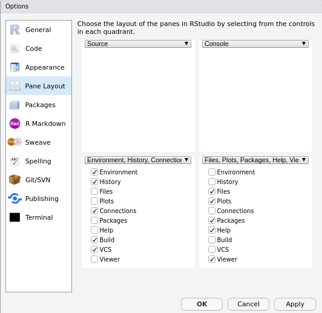

```{r setup, include=FALSE, cache=F, message=F, warning=F, results="hide"}
knitr::opts_chunk$set(cache=TRUE, warning=F)
knitr::opts_chunk$set(fig.path='figs/')
knitr::opts_chunk$set(cache.path='cache/')

knitr::opts_chunk$set(
                  fig.process = function(x) {
                      x2 = sub('-\\d+([.][a-z]+)$', '\\1', x)
                      if (file.rename(x, x2)) x2 else x
                      }
                  )
```

```{r loadstuff, include=FALSE}
knitr::opts_chunk$set(cache=FALSE)

library(tidyverse)
library(post8000r)

```

# Introduction
### Goal for Today

*Introduce you to R and Rstudio.*

###

https://github.com/svmiller/post8000/tree/master/lab-scripts

# What Are R and Rstudio?

### What Is R?

R is an open source programming language with origins in C and FORTRAN. Advantages:

- Flexibility
- It's free (and open source)!
- Ease of handling advanced computational models
- Ease of handling multiple data sets in one session
- Higher demand in industries.

But more importantly, it's free.

### What Is R?

Some disadvantages:

- "Bleeding" edge? (Even then...)
- Higher learning curve
- A "programming language" and not a "program."

Rstudio will help with the learning curve component.

## Getting Started in R and Rstudio
### Getting Started in R and Rstudio

Let's get started in Rstudio first. Select "Tools" in the menu.

- Scroll to "Global Options" (should be at the bottom)
- On the pop-up, select "pane layout."
- Rearrange so that "Source" is top left, "Console" is top right", and the files/plots/packages/etc. is the bottom right.
- Save

###




### Getting Started in R and Rstudio

Hit Ctrl-Shift-N (Cmd-Shift-N if you're on a Mac) to open up a new script.

- Minimize the "Environment/History/Connections/Git" pane in the bottom left.
- Adjust the console output to your liking.

This should maximize your Rstudio experience, esp. as you'll eventually start writing documents in Rstudio.


- That should maximize your Rstudio experience, esp. as you begin to write documents in Rstudio as well.


### A Few Commands to Get Started

`getwd()` will spit out your current working directory.

```{r}
getwd()
```

By default, assuming your username is "Steve":

- Windows: `"C:/Users/Steve/Documents"` (notice the forward slashes!)
- Mac: `/Users/Steve`
- Linux: `/home/Steve`


### Creating Objects

R is an "object-oriented" programming language.

- i.e. inputs create outputs that may be assigned to objects in the workspace.

For example: 

```{r}

a <- 3
b <- 4 
this_is_a_long_object_name_and_you_should_not_do_this <- 5
d <- pi # notice there are a few built-in functions/objects
```

Sometimes it's useful to see all the mess you've created in your workspace

```{r}
ls()
```


### Install Packages

R depends on user-created libraries to do much of its functionality. We're going to start with a few for the sake of this exercise.


```{r, eval=F}
# This will take a while, mostly for tidyverse
install.packages(c("tidyverse","devtools"))

# Once it's installed:
library(tidyverse)
library(devtools)

# Where I'll be putting some example data sets.
devtools::install_github("svmiller/post8000r")

library(post8000r)
```


### Load Data

You can load data from your hard drive, or even the internet. Some commands:

- `haven::read_dta()` for Stata .dta files
- `haven::read_spss()` for SPSS files
- `read_csv()` for CSV files
- `readxl::read_excel()` for MS Excel spreadsheets
- `read_tsv()`for tab-separated values.

Just make sure to apply it to an object.

\scriptsize
```{r, eval=F}
# Note: hypothetical data
Apply <- haven::read_dta("https://stats.idre.ucla.edu/stat/data/ologit.dta")
# County unemployment
Cunemp <- read_tsv("https://download.bls.gov/pub/time.series/la/la.data.64.County") 
```

\normalsize


### Load Data

Some R packages, like my `post8000r` package, has built-in data. For example:

```{r}
data(pwt_sample)
names(pwt_sample)
# also: help(pwt_sample)
```

Brief description: macroeconomic data from select rich countries from PWT

- 23 countries
- `pop`: population in millions
- `hc`: index of human capital per person (based on years of schooling/returns to education)
- `rgdpna`: real GDP at constant 2011 prices.
- `labsh`: labor share of income at current national prices.

## Tidyverse
### Tidyverse

The tidyverse is a suite of functions/packages that totally rethink base R. Some functions we'll discuss:

- `%>%` (the pipe)
- `glimpse()` and `summary()`
- `select()`
- `group_by()`
- `summarize()`
- `mutate()`
- `filter()`

I cannot fully discuss everything from the tidyverse. That's why there's Google/Stackexchange. :P

### `%>%`

The pipe (`%>%`) allows you to chain together a series of tidyverse functions.

- This is especially useful when you're recoding data and you want to make sure you got everything right before saving the data.

You can chain together a host of tidyverse commands within it.

### `glimpse()` and `summary()`

`glimpse()` and `summary()` will get you some basic descriptions of your data. For example:

```{r}
pwt_sample %>% glimpse() # notice the pipe
```

### `glimpse()` and `summary()`

`summary()` is technically not a tidyverse function, but it works within the pipe.

```{r}
pwt_sample %>% summary()
```

### `select()`

`select()` will grab (or omit) columns from the data.

```{r}
# grab everything
pwt_sample %>% select(everything()) 
```

### `select()`

```{r}
# grab everything, but drop the labsh variable.
pwt_sample %>% select(-labsh) 
```

### `select()`

```{r}
# grab just these three columns.
pwt_sample %>% select(country, year, rgdpna)
```

### `group_by()`

`group_by()` might be the most powerful function in tidyverse.

- tl;dr: it allows you to perform functions within specific subsets (groups) of the data.

```{r} 
# Notice we can chain some pipes together
pwt_sample %>%
    # group by country
    group_by(country) %>%
    # Get me the first observation, by group.
    slice(1)
```


### `group_by()`

Notice what would happen in the absence of `group_by()`

```{r} 
pwt_sample %>%
    # Get me the first observation for each country
    slice(1) # womp womp. Forgot to group_by()
```

Caveat: if you're applying a group-specific function (that you need once), it's generally advisable to "ungroup" (i.e. `ungroup()`) the data when you're done.

### `summarize()`

`summarize()` creates condensed summaries of the data, for whatever it is you want.

```{r}
pwt_sample %>%
    # How many observations are in the data?
    summarize(n = n())
```

### `summarize()`

```{r}
# Note: works *wonderfully* with group_by()
pwt_sample %>%
    group_by(country) %>%
    # Give me the max real GDP observed in the data.
    summarize(maxgdp = max(rgdpna, na.rm=T))
    
```


### `mutate()`

`mutate()` creates new columns while retaining original dimensions of the data (unlike `summarize()`).

```{r}
pwt_sample %>%
    # Convert rgdpna from real GDP in millions to real GDP in billions
    mutate(rgdpnab = rgdpna/1000)

```

### `mutate()`

Note: this also works well with `group_by()`

```{r}
pwt_sample %>%
    group_by(country) %>%
    # divide rgdpna over the country's max, for some reason.
    mutate(rgdpnaprop = rgdpna/max(rgdpna, na.rm=T))
```


### `filter()`

`filter()` is a great diagnostic tool for subsetting your data to look at specific observations.

- Notice the use of double-equal signs (`==`) for the `filter()` functions.

```{r}
pwt_sample %>%
    # give me just the USA observations
    filter(isocode == "USA")
```


### `filter()`

```{r}
pwt_sample %>%
    # give me the observations from the most recent year.
    filter(year == max(year))
```

### Don't Forget to Assign

When you're done, don't forget to assign what you've done to an object.

```{r}
pwt_sample  %>%
    # convert real GDP to billions
    mutate(rgdpnab = rgdpna/1000) -> NewObjectName
```

tidyverse's greatest feature is the ability to see what you're coding in real time before commiting/overwrting data.